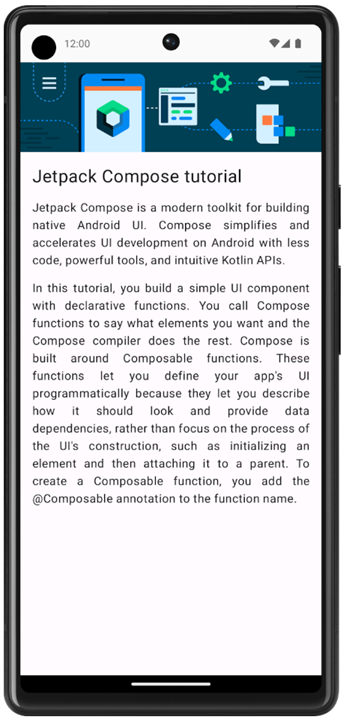
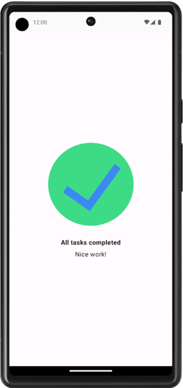
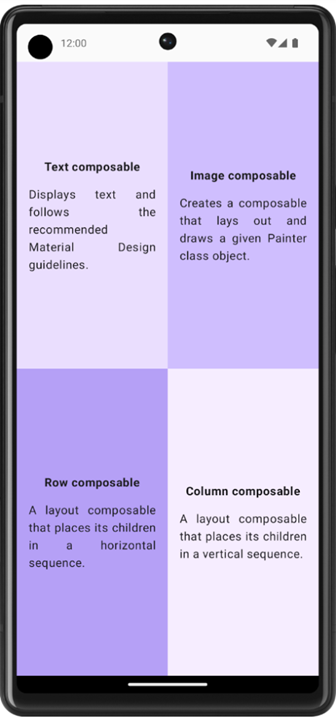
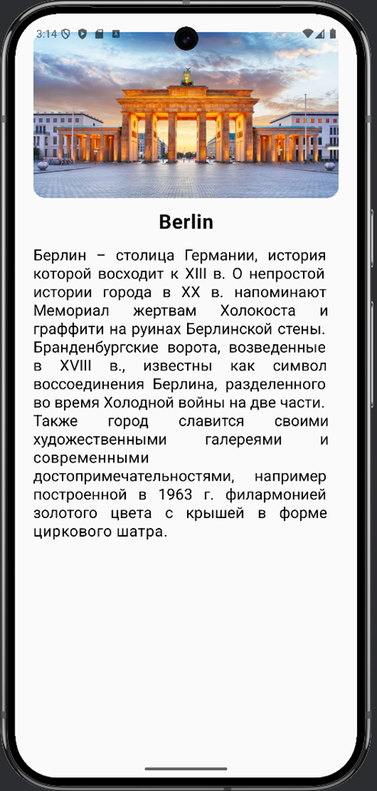
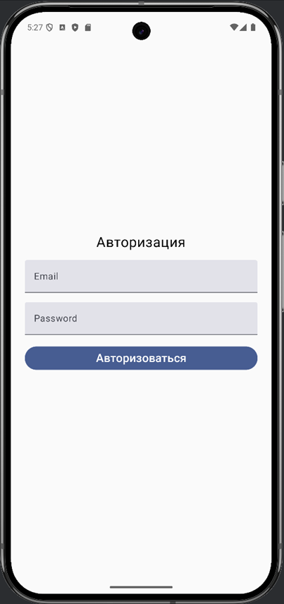
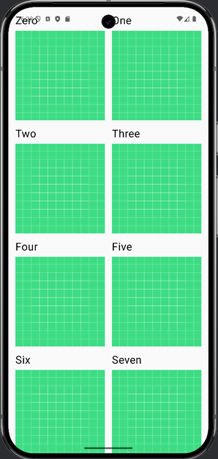
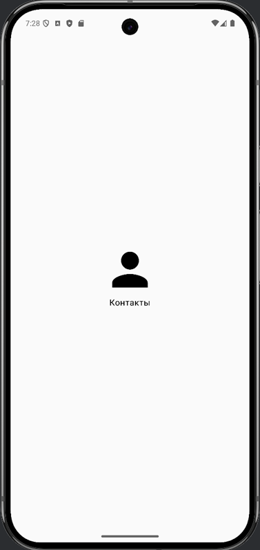

# Самостоятельная работа №1

## Задание №1

После завершения реализации ваш дизайн должен соответствовать следующему снимку экрана:

### Спецификация пользовательского интерфейса

Следуйте этой спецификации UI:
1.	Выведите изображение так, чтобы оно заполняло всю ширину экрана.
2.	Установите для первого Text функции размер шрифта 24sp и отступы 16dp (start,end,bottom, and top)
3.	Установите для второго Text размер шрифта по умолчанию, отступ 16dp (start and end), и выравнивание текста по ширине (Justify)
4.	Установите для третьего компонуемого текста размер шрифта по умолчанию, отступ 16dp (start, end, bottom, and top) и выравнивание текста по ширине.

### Ресурсы

В проект необходимо импортировать предоставленное изображение и следующие строки:
> Jetpack Compose tutorial
 
> Jetpack Compose is a modern toolkit for building native Android UI. Compose simplifies and accelerates UI development on Android with less code, powerful tools, and intuitive Kotlin APIs.

> In this tutorial, you build a simple UI component with declarative functions. You call Compose functions to say what elements you want and the Compose compiler does the rest. Compose is built around Composable functions. These functions let you define your app\'s UI programmatically because they let you describe how it should look and provide data dependencies, rather than focus on the process of the UI\'s construction, such as initializing an element and then attaching it to a parent. To create a Composable function, you add the @Composable annotation to the function name.

## Задача №2

После завершения реализации ваш дизайн должен соответствовать этому снимку экрана:

### Спецификация пользовательского интерфейса

Следуйте этой спецификации UI:

1. Выровнять весь контент по центру экрана по вертикали и горизонтали
2. Установить для первого Text жирный шрифт (Bold), отступ сверху 24dp и отступ снизу 8dp
3. Установить для второго Text размер шрифта 16sp.

### Ресурсы

В проект необходимо импортировать предоставленное изображение и следующие строки:

> All tasks completed

> Nice work!

## Задача №3

После завершения реализации ваш дизайн должен соответствовать этому снимку экрана:

### Спецификация пользовательского интерфейса

Следуйте этой спецификации UI:

1. Установите для всего квадранта (start, end, top, and bottom) отступ 16dp.
2. Выровняйте все содержимое по центру по вертикали и горизонтали в каждом квадранте.
3. Отформатируйте первый Text, жирным шрифтом и установите для него отступ снизу размером 16dp.
4. Установите для второго Text размер шрифта по умолчанию.

### Ресурсы

В проект необходимо импортировать следующие строки:

> Text composable

> Displays text and follows the recommended Material Design guidelines.

> Image composable

> Creates a composable that lays out and draws a given Painter class object.

> Row composable

> A layout composable that places its children in a horizontal sequence.
 
> Column composable

> A layout composable that places its children in a vertical sequence.

И следующие цвета:

- `0xFFEADDFF`
- `0xFFD0BCFF`
- `0xFFB69DF8`
- `0xFFF6EDFF`

# Самостоятельная работа №2

## Задание №1

После завершения реализации ваш дизайн должен соответствовать этому снимку экрана:

### Спецификация пользовательского интерфейса

Следуйте этой спецификации UI:
1. Выведите изображение так, чтобы оно заполняло всю ширину экрана. Отступы у изображения сделать по горизонтали 24dp (horizontal) и 24.dp (top). Округлить края изображения на 16dp используя функцию clip в модификаторе.
2. Установите для первого Text функции размер шрифта 26sp и отступы 24dp (horizontal) по горизонтали. Расположить текст по центру (textAlign). Текст отформатировать жирным шрифтом.
3. Установите для второго Text размер шрифта 20sp, отступ 24dp (horizontal), и выравнивание текста по ширине (Justify)
4. Сделать отступ между элементами по вертикали на 16dp у layout Column.

### Ресурсы

В проект необходимо импортировать предоставленное изображение и следующие строки:
> Berlin

> Берлин – столица Германии, история которой восходит к XIII в. О непростой истории города в XX в. Напоминает Мемориал жертвам Холокоста и граффити на руинах Берлинской стены. Бранденбургские ворота, возведенные в XVIII в., известны как символ воссоединения Берлина, разделенного во время Холодной войны на две части. Также город славится своими художественными галереями и современными достопримечательностями, например построенной в 1963 г. Филармонией золотого цвета с крышей в форме циркового шатра.

## Задание №2

После завершения реализации ваш дизайн должен соответствовать этому снимку экрана:

### Спецификация пользовательского интерфейса

Следуйте этой спецификации UI:
1.	Выровнять весь контент по центру экрана по вертикали и горизонтали
2.	Элементы расположить друг под другом.
3.	Для первого Text функции установить размер шрифта 24sp и отступ снизу размером 16dp.
4.	Установите для первого TextField функции, чтобы оно заполняло всю ширину экрана. Отступы у TextField установить по горизонтали 24dp.
5.	Установите для второго TextField функции, чтобы оно заполняло всю ширину экрана. Отступы у TextField установить по горизонтали 24dp и сверху на 16dp.
6.	Для кнопки установить полную ширину экрана. Сделать отступы сверху на 16dp и по горизонтали на 24dp. И внутри кнопки расположить строку и установить для нее размер 20sp.

### Ресурсы

В проект необходимо импортировать следующие строки:
>Email

>Password

>Авторизация

>Авторизоваться

## Задание №3

После завершения реализации ваш дизайн должен соответствовать этому снимку экрана:

### Спецификация пользовательского интерфейса

Следуйте этой спецификации UI:
1.	Расположить элементы друг под другом (Column) Text и Image.
2.	Для Text установить размер шрифта 24sp
3.	Сделать отступ Text от Image на 8dp.
4.	У Image соотношение сторон установить в 1f (aspectRatio).
5.	Весь контент расположить в вертикальной сетке (LazyVerticalGrid). Вертикальную сетку разбить на 2. Отступы по вертикали и по горизонтали установить в 16dp.
6.	У контента (contentPadding) сделать отступ по горизонтали и по вертикали в 16dp
7.	Внутри вертикальной сетки LazyVerticalGrid вывести каждый элемент через функцию items(), тип должен быть List«T».

## Задание №4

После завершения реализации ваш дизайн должен соответствовать этому снимку экрана:

### Спецификация пользовательского интерфейса

1.	Выровнять весь контент по центру экрана.
2.	Элементы расположить друг под другом, выровнять по центру горизонтально.
3.	У Icon задать размер иконки 100dp.
4.	У Text оставить шрифт по умолчанию.

### Ресурсы

В проект необходимо импортировать следующие строки:
> Контакты